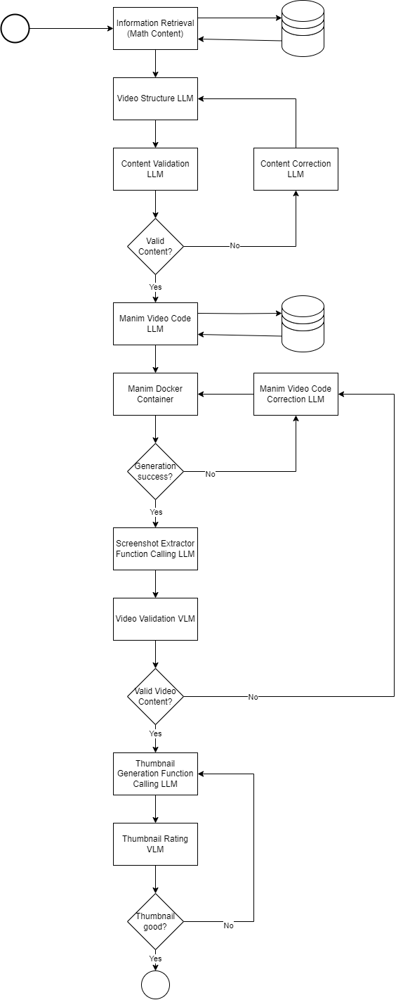

# Manim Video Generation Pipeline ("AI Teaching Assistant")
## Elective Module "Generative AI" Portfolio

### Projektziel
Das Ziel des Projekts war die Erprobung verschiedener Sprachmodelle zur Generierung und Validierung von validem Python Code zur Generierung von Manim Videos angelehnt an den Stil von [3Blue1Brown](https://www.youtube.com/c/3blue1brown).

Dabei sollte ein Fokus auf die Verwendung von Open-Source und Open-Weight Modellen gesetzt werden, um größmögliche Kontrolle über die Modelle in der Pipeline zu haben und Kosten zu reduzieren.

### Projektstruktur
Das Projekt orientiert sich an dem nachfolgenden Flussdiagramm mit einigen Änderungen, die seit der Vorstellung der Idee in der Abschlusspräsentation des Kurses aufgekommen sind.

Unter anderem wurden der Planungsteil, der Videogenerierungsteil und der Thumnailgenerierungsteil in seperate Pipelines/Workflows aufgeteilt und teils unterschiedlich umgesetzt, sodass nur noch die Ausgabe des Planungsteils für den Videogenerierungsteil und den Thumbnailgenerierungsteil benötigt wird und diese beiden Teile theoretisch parallel ausgeführt werden können. Hierdurch ist auch die etappenweise Ausführung der Pipeline möglich, sodass mögliche Fehler während der Ausführung nicht zu einem kompletten Verlust der Zwischenergebnisse führt.

RAG wurde als optionale Komponente belassen und kann unter anderem den Kontext des Planungsteils mit Informationen aus Serlo Artikeln anreichern. Außerdem wurde ein RAG basierter Few-Shot Prompting Ansatz in `Experiments/RAG/RAG_Vergleich.ipynb` durchgeführt und die Ergebnisse in `Experiments/RAG/RAG_Vergleich.md` festgehalten.

Die Struktur der endgültigen Manim Code Generation und Thumbnail Generation Workflows können im Ordner `Pipeline-Visualizations` eingesehen werden.

### Verwendete Modelle
Da die Pipeline auf eine Vielzahl verschiedener Modelle zur Generierung von Sprache, Code und Bildern zurückgreift, wurde die Pipeline für die Ausführung auf einer Cloud-Instanz mit A40 GPU entwickelt und optimiert. Auch wenn diese Hardware deutlich leistungsfähiger ist als Studierendenlaptops kann es dazu kommen, dass einige Modelle lange Ladezeiten aufweisen oder Abstürze durch zu lange Ausführung bzw. überlaufenden VRAM vorkommen.

Embedding Model (RAG):
- [mxbai-embed-large-v1](https://huggingface.co/mixedbread-ai/mxbai-embed-large-v1)
- [deepset-mxbai-embed-de-large-v1](https://huggingface.co/mixedbread-ai/deepset-mxbai-embed-de-large-v1)

Large Language Model (Generator/Reviewer Video Planning):
- [Phi-4](https://huggingface.co/microsoft/phi-4)

Code Language Model (Code Generation, Function Calling):
- [Qwen2.5-Coder 7B Instruct](https://huggingface.co/Qwen/Qwen2.5-Coder-7B-Instruct)
- [Qwen2.5-Coder 14B Instruct](https://huggingface.co/Qwen/Qwen2.5-Coder-14B-Instruct)

Vision Language Model (Video Reviewer):
- [Llama3.2 11B Vision Instruct](https://huggingface.co/meta-llama/Llama-3.2-11B-Vision-Instruct)

Image Generation:
- [Shuttle 3.1 Aesthetic](https://huggingface.co/shuttleai/shuttle-3.1-aesthetic)
- [Stable Diffusion XL](https://huggingface.co/stabilityai/stable-diffusion-xl-base-1.0)  (schnellere, aber schlechtere Alternative)