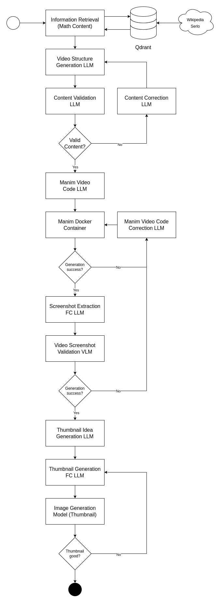

# Manim Video Generation Pipeline
## Elective Module "Generative AI" Portfolio

### Project Structure

### Models
Language Model:
- [Qwen2.5 7B Instruct](https://huggingface.co/Qwen/Qwen2.5-7B-Instruct)

Code Language Model:
- [Qwen2.5-Coder 7B Instruct](https://huggingface.co/Qwen/Qwen2.5-Coder-7B-Instruct)

Vision Language Model:
- [Llama3.2 11B Vision Instruct](https://huggingface.co/meta-llama/Llama-3.2-11B-Vision-Instruct)

Image Generation:
- [Shuttle 3 Diffusion](https://huggingface.co/shuttleai/shuttle-3-diffusion)
- [Shuttle 3.1 Aesthetic](https://huggingface.co/shuttleai/shuttle-3.1-aesthetic)
- [Auraflow](https://huggingface.co/fal/AuraFlow)